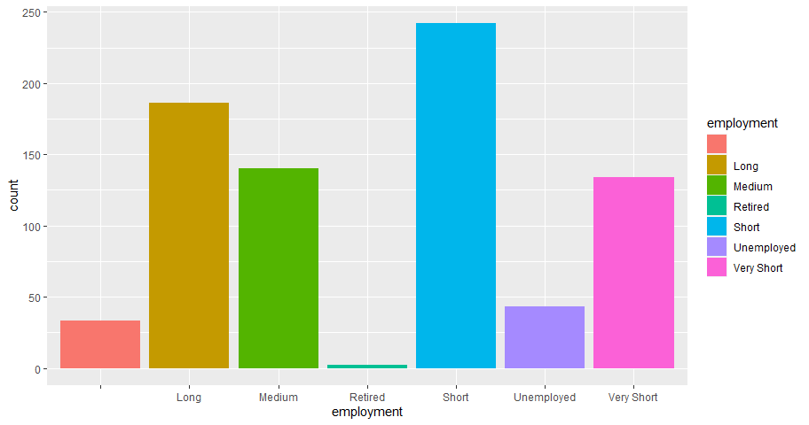
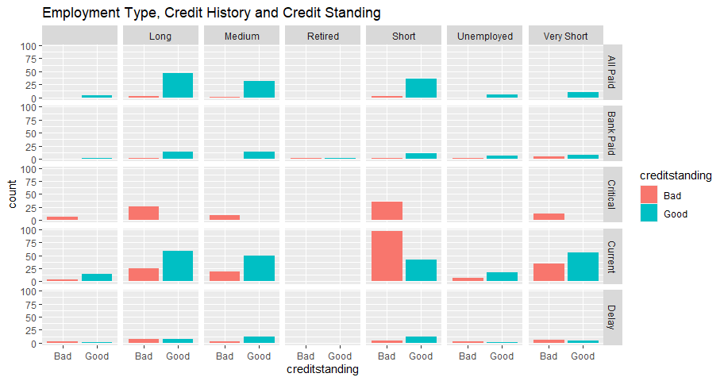
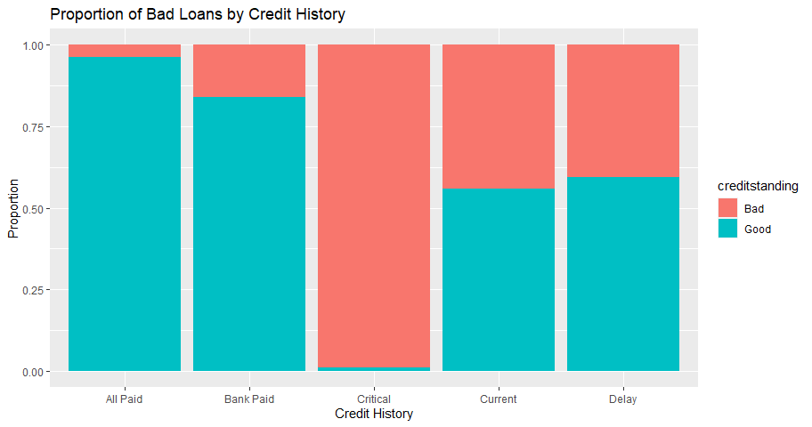
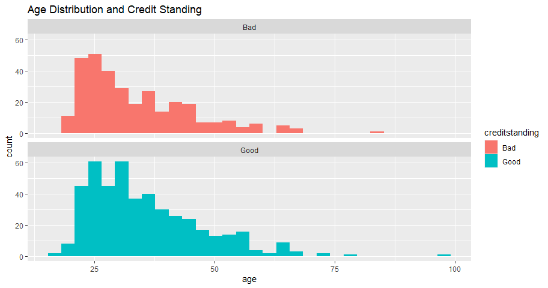
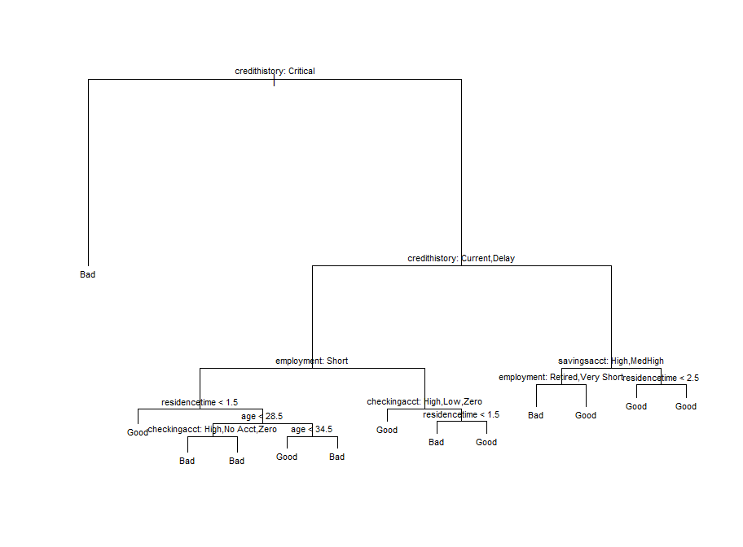
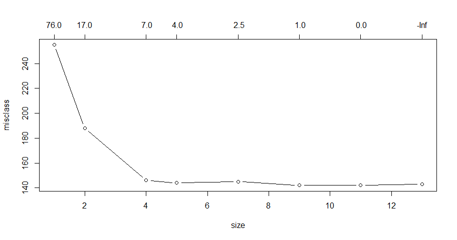
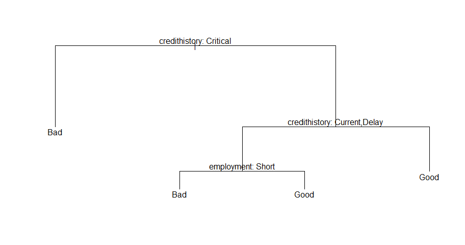
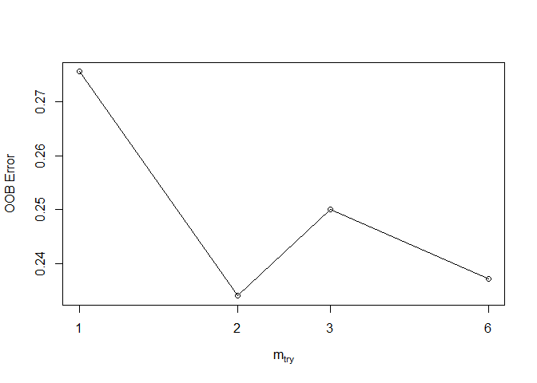
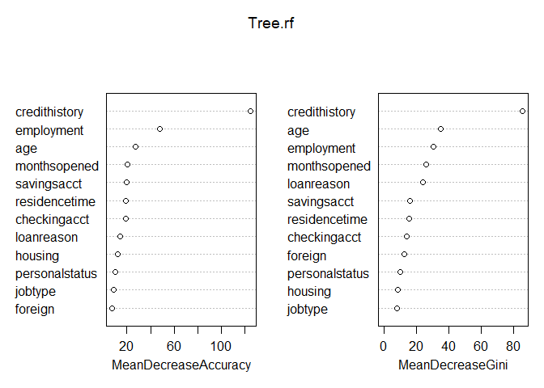

Loan Status Prediction of Bank Clients
================


## Summary

Detailed model building was carried out based on ABC Bank’s loan clients
with the main goal of improving decision making when classifying the
credit standing of future customers. The bank’s current customer data
was used to train various models in R Studio, with the pruned decision
tree model being the most accurate at predicting whether a client’s
credit standing was Good or Bad. This model was then deployed and used
on a selection of new loan clients in order to classify their potential
creditworthiness.

## Introduction

ABC Bank has a loan portfolio consisting of 780 customers and various
details are known about each client, such as employment status, housing
type, martial status and age amongts others. The bank uses a mixture of
their own in-house grading system and human input to grade each
customer’s credit standing as either “Good” or “Bad”. The customer
rating currently sits at 60% “Good”. However, mistakes are sometimes
made, so the bank would like to increase the accuracy of their decision
making process due to the cost of misclassiying a Bad loan as Good,
which can be quite high.

The project we will go through the stages of a methodology known as
“CRISP-DM” \[r1\] which stands for “cross-industry process for data
mining”. CRISP-DM has the following six stages:

  - **Business Understanding**
      - What are the business objectives of this project? Olivia the
        bank manager wants to classify her customers as good or bad with
        more accuracy. Misclassifying a bad loan as good can be a costly
        mistake for the bank.
  - **Data Understanding**
      - Exploratory data analysis will be carried out on the list of
        customers the bank has supplied. Who are the customers? Are
        there any trends or patterns in the data? Is there anything we
        can infer from grouping certain customers?
  - **Data Preparation**
      - Cleaning, organizing and preparing data for feeding into
        prediciton models. Anomalies and / or missing data will be dealt
        with.
  - **Modeling**
      - Various prediction models will be created, optimized and trained
        using the customer data supplied by ABC Bank. The models that
        will be built are: Decision Tree, Pruned Tree, Random Forest,
        Gradient Boosting and General Linear Model.
  - **Evaluation**
      - The models will then be tested and evaluated on what is called
        “unseen data”. This is customer data that has been split and
        kept separately from the original bank supplied data. Ommiting
        data in this way for use in later evaluation allows the “real
        world” performance of models to be measured.
  - **Deployment**
      - Once satisfactory model performance has been reached, the model
        will be deployed and used on future customers.

## Loading Packages

The first step is to load the required packages into R Studio .
**Note:** If the reader wishes to run the code supplied with this
report, you must place the accompanying csv files in your working
directory, and the directory in the read\_csv function below must be
changed to your working directory. The following packages must also be
installed:

``` r
 # install.packages("readr")
 # install.packages("aCRM")
 # install.packages("DataExplorer")
 # install.packages("ggplot2")
 # install.packages("caTools")
 # install.packages("caret")
 # install.packages("rms")
 # install.packages("plottr")
 # install.packages("PerformanceAnalytics")
 # install.packages("dplyr")
 # install.packages("tree")
 # install.packages("randomForest")
 # install.packages("pROC")
 # install.packages("ROCR")
 # install.packages("gbm")
 # install.packages("DT")
# install.packages("gbm")
```

``` r
library(DT)
library(gbm)
library(ROCR)
library(pROC)
library(dplyr)
library(PerformanceAnalytics)
# library(DataExplorer)
library(readr) # for reading csv
library(aCRM) # for impute missings
library(ggplot2)
library(caTools) # for sample.split
library(caret)
# library(rms)
library(tree)
library(randomForest)
```

## Exploratory Data Analysis

The dataset was first opened in Microsoft Excel for some light editing
before more techical work began. The spaces were removed from column
names, as were unweidly characters such as parentheses . Column names
were simplified and one minus number was found in the “Residence Time in
Cureent District” column. This negative number was replaced with the
median residence time.

For further cleaning, the dataset was imported into Rstudio. Names of
the columns were changed to lower case. There were some, but not many,
missing values in the dataset, so the function imputeMissings() was
called using the aCRM package\[2\], which uses the mode of the variable
to fill in the missing values. In the case of numeric variables, the
median is used. The structure is then checked to ensure all the
variables are encoded correctly - factor or numeric. Finally the ID
column was removed as this serves no value in predicting credit
standing.

``` r
Testing <- read.csv("D:/Semester 1/DSA/Credit Project/attempt 2/For Submission/Testing.csv")

names(Testing) <- tolower(names(Testing))
dim(Testing)
# describe(Testing)
Testing <- imputeMissings(Testing)
str(Testing)
Testing$id <- NULL
```

The dataset supplied from the bank contains 780 observations or customer
records, with 14 variables all listed below. There are three numeric
variables - *Age*, *Residence Time* and *Months Opened*. The remaining
are categorical, with *“Credit Standing”* as our dependent variable ie.
the variable we want to be able to
    predict.

    ##  [1] "checkingacct"   "credithistory"  "loanreason"     "savingsacct"   
    ##  [5] "employment"     "personalstatus" "housing"        "jobtype"       
    ##  [9] "foreign"        "monthsopened"   "residencetime"  "age"           
    ## [13] "creditstanding"

A quick look at the summary statistics reveal some basic information
about each variable. For example, the majority of the bank’s customers
are foreign, the average age of the customer is 34 and most of the
customers own their own houses. The second table is a sample of the
first 5 customers from the
    dataset.

    ##   checkingacct   credithistory           loanreason   savingsacct 
    ##  High   : 45   All Paid :138   Car New        :191   High   : 29  
    ##  Low    :201   Bank Paid: 63   Small Appliance:186   Low    :500  
    ##  No Acct:271   Critical : 92   Furniture      :160   MedHigh: 49  
    ##  Zero   :263   Current  :423   Business       : 82   MedLow : 80  
    ##                Delay    : 64   Car Used       : 75   No Acct:122  
    ##                                Education      : 45                
    ##                                (Other)        : 41                
    ##       employment   personalstatus  housing          jobtype    foreign  
    ##            : 33           :  6         :  5   Management:101   No :253  
    ##  Long      :186   Divorced:273    Other: 94   Skilled   :498   Yes:527  
    ##  Medium    :140   Married : 70    Own  :524   Unemployed: 19            
    ##  Retired   :  2   Single  :431    Rent :157   Unskilled :162            
    ##  Short     :242                                                         
    ##  Unemployed: 43                                                         
    ##  Very Short:134                                                         
    ##   monthsopened   residencetime         age        creditstanding
    ##  Min.   :  5.0   Min.   : 1.000   Min.   :18.00   Bad :319      
    ##  1st Qu.: 13.0   1st Qu.: 2.000   1st Qu.:26.00   Good:461      
    ##  Median : 19.0   Median : 3.000   Median :32.00                 
    ##  Mean   : 23.2   Mean   : 2.874   Mean   :34.75                 
    ##  3rd Qu.: 29.5   3rd Qu.: 4.000   3rd Qu.:41.00                 
    ##  Max.   :120.0   Max.   :10.000   Max.   :99.00                 
    ## 

-----

The below proportions of Bad to Good loans gives the baseline rate,
which in this case is 59%. If the bank simply categorizes all loans as
“Good”, they would be correct 59% of the time. This will also be used
as a benchmark when evaluating the performance of prediction models.

    ## 
    ##  Bad Good 
    ## 0.41 0.59

## Visualising the Customer Data

The majority of customers are short term employed, which is slightly
surprising as approximately 60% of the banks loans are classified as
“Good”. One would think short term employed customers would be a
riskier group to lend to. Perhaps they make up the a sizeable proportion
of the 40% Bad loans.

<!-- -->

The dataset is slightly imbalanced with more Good loans than Bad.

<!-- -->

The majority of loan recipients are under 50 years of age, and it seems
like the 18 to 30 age bracket have the highest number of loans.

<!-- -->

In the below diagram the relationship between employment type and credit
history can be seen in terms of credit standing. Along the top are the
labels for each type of employment. Down the right hand side are the
different levels of credit history, and at each intersection we have the
number of good versus bad loans. It is obvious to see that customers in
short term unemployment with either critical or current credit history
have a higher proportion of bad loans compared to the rest of the
customers. During model building it will become evident if these two
variables are important in determining the status of a loan.

<!-- -->

Since credit history seemed to play a strong role in the above diagram,
it was isolated for the blow plot against credit standing to get the
proportions for each credit history type. Critical has the highest
proportion of bad loans.

<!-- -->

And finally a look at the distribution of age and credit standing. It is
quite an equal distribution and it seems like age may not play a very
strong role in determining if a loan should be categorized as good or
bad.

<!-- -->

## Model Building

#### Creating a Decision Tree

A decision tree model will be developed in order to categorize loans as
good or bad. In the below code an 80/20 split is made on the original
data, creating a training set (80%) and testing set (20%). The tree will
learn using the training data while final prediction accuracy will be
evaluated using the 20% test set.

``` r
set.seed(896)
sample <- sample.split(Testing$creditstanding, 0.8)
train.data <- subset(Testing, sample==TRUE)
test.data <- subset(Testing, sample==FALSE)
set.seed(896)
mytree=tree(creditstanding~.,data=train.data)
```

Below is the text summary of the tree along with the tree diagram. The
tree has used 6 variables from the dataset to classify the customers:
credithistory, employment, loanreason, residencetime, checkingacct, and
savingsacct. The current number of terminal nodes in the tree is 11 ie.
there are 11 ways to classify the customers depending on their
backround.

    ## 
    ## Classification tree:
    ## tree(formula = creditstanding ~ ., data = train.data)
    ## Variables actually used in tree construction:
    ## [1] "credithistory" "employment"    "residencetime" "age"          
    ## [5] "checkingacct"  "savingsacct"  
    ## Number of terminal nodes:  13 
    ## Residual mean deviance:  0.8001 = 488.9 / 611 
    ## Misclassification error rate: 0.1971 = 123 / 624

<!-- -->

The decision tree is then applied to the 20% testing data and used to
predict the credit standing for each customer in that dataset.
Performance can be analysed using a confusion matrix which shows when
the model misclassified good as bad and vice versa, and correctly
classiffied good and bad. Simple calculations can also be carried out
using this confusion matrix, such as Accuracy, False Positive Rate, and
Misclassification Error.

The accuracy of this model is 76%  
The False Positive Rate, ie. when it predicted a bad loan as good, is
36%  
The True positive Rate ie. when it predicted a good loan correctly is
84%  
The Missclassification error is 23%

The model seems to be better at predicting good loans and is having
trouble classifying bad loans. It categorized 36% of bad loans as good.

    ##           actual
    ## Prediciton Bad Good
    ##       Bad   34    9
    ##       Good  30   83

    ## Missclassification error: 0.25

#### Fine tuning the Decision Tree

The tree model could possibly be simplified and made with less
complexity ie. with less terminal nodes. K fold cross validation can be
used to idenitify the optimum number of nodes to use in the tree. By
default K = 10, which means that the data will be split into - 10%
training and 90% testing. The cross validation function will use 90% of
the data to train the tree, and the 10% to test. The original data will
then be split again, with a different 90% and 10% selected. This is
repeated until all the data has been used as a 10% test dataset against
the remaining 90%. The results is an analysis of the misslclassification
error of trees with different numbers of leaves or terminal nodes. From
the below diagram we can see that cross validation has identified four
nodes as the optimum tree complexity.

``` r
set.seed(896)
mytree.cv=cv.tree(mytree,FUN = prune.misclass)
plot(mytree.cv,type="b")
```

<!-- -->

The tree is pruned to four nodes with the following code below. The
diagram of this new tree shows a clearly simplified structure compared
to the unpruned tree earlier. It does however have a higher
misclassification error, but it is yet to be tested on the test dataset.

``` r
set.seed(896)
mytree.prune=prune.tree(mytree,best=4)
summary(mytree.prune)
```

    ## 
    ## Classification tree:
    ## snip.tree(tree = mytree, nodes = c(13L, 12L, 7L))
    ## Variables actually used in tree construction:
    ## [1] "credithistory" "employment"   
    ## Number of terminal nodes:  4 
    ## Residual mean deviance:  0.9503 = 589.2 / 620 
    ## Misclassification error rate: 0.2324 = 145 / 624

``` r
plot(mytree.prune);text(mytree.prune,pretty=0)
```

<!-- -->

``` r
summary(mytree)
```

    ## 
    ## Classification tree:
    ## tree(formula = creditstanding ~ ., data = train.data)
    ## Variables actually used in tree construction:
    ## [1] "credithistory" "employment"    "residencetime" "age"          
    ## [5] "checkingacct"  "savingsacct"  
    ## Number of terminal nodes:  13 
    ## Residual mean deviance:  0.8001 = 488.9 / 611 
    ## Misclassification error rate: 0.1971 = 123 / 624

The newly pruned tree will now be used to predict the test data credit
standing. As seen below, the pruned tree has virtually the same
misclassification error as the unpruned tree when used on the test data.
It is generally better to go with a less complex model if measures of
accuracy are virutally identical (occam’s razor) so in this case the
pruned tree should be selected.

``` r
mytreepred=predict(mytree.prune,test.data,type = "class")
table(mytreepred,test.data$creditstanding)
```

    ##           
    ## mytreepred Bad Good
    ##       Bad   39   11
    ##       Good  25   81

``` r
cat("Missclassification error:",mean(mytreepred != test.data$creditstanding))
```

    ## Missclassification error: 0.2307692

## Using the Model on our Scoring Data

#### Predicting new customer loans as Good or Bad.

First the scoring data is imported and the ID column is removed. Three
customers are randomly sampled from the scoring set and sent to a new
dataframe called “Three\_Clients”. The pruned tree is then used to
predict whether they should be classified as potential good or bad loan
clients. This predicted data is then entered into a new column in the
Three Clients dataset, which is output below. Two customers were rated
good and one bad.

``` r
scoring <- read.csv("C:/Allegiant/My_CIT_R_Stuff/Scoring.csv")
scoring$id <- NULL 
names(scoring) <- tolower(names(scoring))
set.seed(896)
Three_Clients <- scoring[sample(nrow(scoring), 3), ]
Three_Clients$creditstanding<-predict(mytree.prune,Three_Clients, type="class")
datatable(Three_Clients, extensions = 'FixedColumns',options = list(dom = 't',scrollX = T,fixedColumns = T))
```

<!--html_preserve-->

<div id="htmlwidget-1bd4b462153591ae3baf" class="datatables html-widget" style="width:100%;height:auto;">

</div>

<script type="application/json" data-for="htmlwidget-1bd4b462153591ae3baf">{"x":{"filter":"none","extensions":["FixedColumns"],"data":[["11","2","3"],[791,782,783],["No Acct","Low","No Acct"],["Critical","Current","Current"],["Car Used","Small Appliance","Small Appliance"],["Low","Low","Low"],["Medium","Medium","Very Short"],["Single","Single","Divorced"],["Own","Rent","Own"],["Management","Skilled","Skilled"],["Yes","No","No"],[25,37,13],[3,4,2],[37,23,28],["Good","Bad","Bad"]],"container":"<table class=\"display\">\n  <thead>\n    <tr>\n      <th> <\/th>\n      <th>id<\/th>\n      <th>checkingacct<\/th>\n      <th>credithistory<\/th>\n      <th>loanreason<\/th>\n      <th>savingsacct<\/th>\n      <th>employment<\/th>\n      <th>personalstatus<\/th>\n      <th>housing<\/th>\n      <th>jobtype<\/th>\n      <th>foreign<\/th>\n      <th>monthsopened<\/th>\n      <th>residencetime<\/th>\n      <th>age<\/th>\n      <th>creditstanding<\/th>\n    <\/tr>\n  <\/thead>\n<\/table>","options":{"dom":"t","scrollX":true,"fixedColumns":true,"columnDefs":[{"className":"dt-right","targets":[1,11,12,13]},{"orderable":false,"targets":0}],"order":[],"autoWidth":false,"orderClasses":false}},"evals":[],"jsHooks":[]}</script>

<!--/html_preserve-->

## Random Forests and GBM Boosting

Two extra models will be developed to determine if accuracy rates can be
improved - Random Forests and Gradient Boosting.

#### Random Forests

The first step in the random forests model development is to get the
optimum “mrtry” number for a random forest model. Mtry is the number
variables randomly sampled and used for decision making at each node in
the model. Tpyically the square root of the numbr of predictors is the
recommended mtry,\[4\] but in this instance the tuneRF function will be
used to identify this number.

``` r
set.seed(896)
bestmtry <- tuneRF(train.data[-13],train.data$creditstanding,improve = .01,trace = T,doBest = FALSE)
```

    ## mtry = 3  OOB error = 25% 
    ## Searching left ...
    ## mtry = 2     OOB error = 23.4% 
    ## 0.06410256 0.01 
    ## mtry = 1     OOB error = 27.56% 
    ## -0.1780822 0.01 
    ## Searching right ...
    ## mtry = 6     OOB error = 23.72% 
    ## -0.01369863 0.01

<!-- -->

``` r
datatable(bestmtry)
```

<!--html_preserve-->

<div id="htmlwidget-0656af6d1870f5c99e7d" class="datatables html-widget" style="width:100%;height:auto;">

</div>

<script type="application/json" data-for="htmlwidget-0656af6d1870f5c99e7d">{"x":{"filter":"none","data":[["1.OOB","2.OOB","3.OOB","6.OOB"],[1,2,3,6],[0.275641025641026,0.233974358974359,0.25,0.237179487179487]],"container":"<table class=\"display\">\n  <thead>\n    <tr>\n      <th> <\/th>\n      <th>mtry<\/th>\n      <th>OOBError<\/th>\n    <\/tr>\n  <\/thead>\n<\/table>","options":{"columnDefs":[{"className":"dt-right","targets":[1,2]},{"orderable":false,"targets":0}],"order":[],"autoWidth":false,"orderClasses":false}},"evals":[],"jsHooks":[]}</script>

<!--/html_preserve-->

The tuneRF function has given an optimum mtry of 6 as seen in the table
above which lists the out of bag error for each mtry. This number will
be used in the development of the model below, using the randomForest
package. The ntree function was tested on various number of trees and
ntree=1000 was found to have the best accuracy rate.

``` r
set.seed(896)
Tree.rf <- randomForest(creditstanding~.,data = train.data, mtry=6, importance=TRUE,ntree=1000)
Tree.rf$confusion
```

    ##      Bad Good class.error
    ## Bad  178   77   0.3019608
    ## Good  69  300   0.1869919

The influence of each of the variables on the response variable can be
seen in this plot. Credit history seems to have a strong influence,
followed by employment then age.

``` r
varImpPlot(Tree.rf)
```

<!-- -->

The random forest model is then used to predict the test data response
variable. A misclassification score of .28 means that this model is
performing worse than our basic decision tree, which had a
misclassification error of .23. The next model to try is the Gradient
Boosting method.

``` r
RFpred <- predict(Tree.rf,test.data,type="class")
table(RFpred,test.data$creditstanding)
```

    ##       
    ## RFpred Bad Good
    ##   Bad   39   19
    ##   Good  25   73

``` r
print(mean(RFpred != test.data$creditstanding))
```

    ## [1] 0.2820513

#### Boosting with GBM

The first step is to change the response variable to numeric 1 and 0 as
this is the only format the GBM function accepts. The first boosting
model is created, starting with ntrees of ten thousand. After the model
is created the gbm.perf() function is used to create a plot from which
will show the optimum number of ntrees. ntrees=10000 has the smallest
out of bag error. Various tuning paramenteres were adjusted such as
interaction and shrinkage, and the best values found are the ones in the
code
below.

``` r
train.data$creditstanding <- ifelse(train.data$creditstanding == "Bad", 0, 1)
test.data$creditstanding <- ifelse(test.data$creditstanding == "Bad", 0, 1)
set.seed(896)
boost.data=gbm(creditstanding~.,data=train.data,distribution="bernoulli",n.trees=10000, interaction.depth=3,shrinkage = .01)
ntree_opt_oob <- gbm.perf(plot.it = T,boost.data, method = "OOB")
```

<!-- -->

``` r
summary(boost.data)
```

<!-- -->

    ##                           var   rel.inf
    ## credithistory   credithistory 18.844550
    ## employment         employment 15.185534
    ## loanreason         loanreason 14.775356
    ## age                       age 13.442926
    ## monthsopened     monthsopened  8.873481
    ## savingsacct       savingsacct  6.348480
    ## checkingacct     checkingacct  5.526857
    ## residencetime   residencetime  4.779284
    ## personalstatus personalstatus  4.420365
    ## housing               housing  2.861464
    ## jobtype               jobtype  2.738211
    ## foreign               foreign  2.203492

The next step is to use the new model to create predictions based on the
test data. Once the prediction is made, the results are re-converted
back to “Good/Bad” factors and a confusion matrix is created. As we can
see from the results below, the Gradient Boosting model is the worst
performer yet with a misclassification error of approximately 30%. It is
also misclassifying the majority of Bad loans as Good.

``` r
Myboost=predict(boost.data,test.data,n.trees=10000,type ="response")
MyboostROC <- Myboost
train.data$creditstanding <- as.factor(ifelse(train.data$creditstanding == 0, "Bad", "Good"))
test.data$creditstanding <- as.factor(ifelse(test.data$creditstanding == 0, "Bad", "Good"))
Myboost <- as.factor(ifelse(Myboost>0.5,"Good","Bad"))
table(Myboost,test.data$creditstanding)
```

    ##        
    ## Myboost Bad Good
    ##    Bad   39   17
    ##    Good  25   75

``` r
print(mean(Myboost != test.data$creditstanding))
```

    ## [1] 0.2692308

#### Which model to choose?

A review of the different misclassification errors of the models
developed:

Decision Tree: 23%

Pruned Deciusion Tree: 23%

Random Forests: 28%

Gradient Boosting: 30%

It is clear that the original decision trees are the best models,
specifically the pruned decision tree. Pruning reduced complexity
without sacrificing accuracy, and is also easier to visualise and
explain.

## Cost of Misclassification

One noticeable feature of the results was that there was actually a high
number of instances where bad was classified as good, which is perhaps
due to the dataset’s slight imbalance towards good loans. Training a
model on an imbalanced dataset can sway it towards classifying the
majority class more often than not due to the learning process focusing
on accuracy without taking the proportion of classes into account.\[5\]
Therefore models were slightly biased and were more likely to classify a
loan as good rather than bad

The bank has stated that the cost of misclassifying a bad loan as good
can be five times as costly as misclassfying a good loan as bad. To
rectify this, the best model can be re-trained to give more accurate
results. For this, downsampling will be used.

The original dataset will be downsampled so both Good and Bad
observations have a 50/50 split. New training and test sets will be
created and the best model, currently either the pruned decision tree or
original tree, will be retrained with this data. The regular decision
tree will be used without the extra step of pruning for simplicity as
they both have virtually the same performance.

``` r
set.seed(896)
Testing2 <- downSample(yname = "creditstanding",Testing[-13], Testing$creditstanding)
nrow(Testing2[Testing2$creditstanding=="Good",])/nrow(Testing2)
```

    ## [1] 0.5

``` r
set.seed(896)
sample <- sample.split(Testing2$creditstanding, 0.8)
train.data2 <- subset(Testing2, sample==TRUE)
test.data2 <- subset(Testing2, sample==FALSE)
```

The new downsampled data will now be used to train the decision tree,
which will then be evaluated on the the downsampled test set.

``` r
set.seed(896)
mytree=tree(creditstanding~.,data=train.data2)
set.seed(896)
mytreepred=predict(mytree,test.data,type = "class")
table(mytreepred,test.data$creditstanding)
```

    ##           
    ## mytreepred Bad Good
    ##       Bad   46   23
    ##       Good  18   69

The accuracy of this model is lower than previous models at 73%  
However, the good news is that the False Positive Rate, ie. when it
predicted a bad loan as good, has reduced to 12.5%  
The True positive Rate ie. when it predicted a good loan correctly has
decreased to 59%  
The Missclassification error is 27%

From the confusion matrix above the re-trained decision tree using
downsampled data is now more accurately predicting bad loans. The false
positive rate (ie. predicting bad as good) has decreased to 12.5% from
roughly 36% previously. However the accuracy of predicting good loans
has decreased. The bank will need to have a discussion on whether this
is an acceptable model and if they are comfortable with the new model’s
tendency to classify Good as Bad. Perhaps they can use more human input
whenever a loan is classified as bad by this model.

Further testing could be done to increase accuracy or balance out the
confusion matrix, such as reclassifying Good and Bad as 1 and 0, and
creating logistic regression models which output probabilities rather
than classification models, and adjusting the threshold of where exactly
a result is graded as Good or Bad. For example, does a probability of
0.5 mean the loan is Good? What about 0.6 or 0.4? Finding the best
threshold can be done with the help of a ROC curve which is discussed in
question (b) at the end of the report. Further model building and tuning
may need to be carried out if the bank is not satisfied with the
re-trained model.

#### Consecutive numbers?

In order to find a suspicious grading pattern in the banks dataset, I
used the pruned decision tree to predict the results on the original
unpslit data - no test or training. I thought there may be a suspicious
pattern when comparing actual results and predicted results in Excel but
nothing jumped out at me.

I then filtered the data in excel manually according to the
classification criteria of the decision tree for each “Bad” result ie.
Delay in Credit History + Loan Reason: Furniture etc. however no
consecutive or suspicious pattern was found.

#### ROC Curve

An ROC Curve is a plot of the true positive rate ( TPR: how often a
model correctly predicts a positive eg. yes, good or 1) against the
false positive rate of the same model (FPR: how often the model
incorrectly predicts a positive when it is actually a negative). The ROC
curve can show how well a model distinguishes between these two
classifiers and can also be used to tell what the optimum threshold is
for converting probabilities to a classification.\[6\] For example, a
model may generally classify a response as “Yes” for probabilities of
0.5 and above and “No” for those below. Tuning this threshold up or down
may result in more satisfactory prediction rates. The curve contains all
TPR and FPR for every possible threshold which ranges from 0 to 1, and
the higher the curve is (or the greater the area under the curve is),
the better the model is at predicting classes.

The below plot is an ROC curve for the Gradient Boosting model developed
earlier in the report. The straight line running through the plot
signifies the level at which the model is no better than random
guessing. Ideally the curve should be well above that line, and close to
the top left corner.\[7\] You can also see from the plot that if you
wish to decrease the false positive rate, true positive rate will also
be affected. For example decreasing the false positive rate to 0.2
sounds ideal, but you will also decrease the true positive rate to
around .018. However depending on the business needs, for example in the
case of Olivia’s bank, a small drop in true posiive rate may be
acceptable if their main priority is decreasing the false positive rate.

<!-- -->

#### References

\[1\] <https://www.sv-europe.com/crisp-dm-methodology/>

\[2\] <https://www.rdocumentation.org/packages/aCRM/versions/0.1.1>

\[3\] James, G. (2013) *An Introduction to Statistical Learning* Chapter
8 pages 303-307.

\[4\] James, G. (2013) *An Introduction to Statistical Learning* Chapter
8 page 320

\[5\] <https://www.svds.com/learning-imbalanced-classes/>

\[6\] <https://www.youtube.com/watch?v=ypO1DPEKYFo>

\[7\] James, G. (2013) *An Introduction to Statistical Learning* Chapter
4 pages 147-148
